# Paylocity Benefits Dashboard — UI Bug Report

## Summary

| ID | Title | Priority | Type |
|----|------|------|------|
| UI-001 | Username and Password fields allow extremely large maximum input length | Medium | Validation |
| UI-002 | Login with invalid credentials returns HTTP 405 | Medium | Error Handling |
| UI-003 | Dashboard title displayed on login page | Medium | UI |
| UI-004 | First Name and Last Name displayed in incorrect columns | Medium | UI |
| UI-005 | Name fields allow special characters | Medium | Validation |
| UI-006 | No error message displayed when adding employee fails | High | Validation |
| UI-007 | Employee ID displayed as raw GUID | Medium | UI |
| UI-008 | Table layout breaks with long names | Low | Layout |
| UI-009 | Employee table has no default sorting | Medium | Usability |
| UI-010 | Table columns cannot be sorted | Medium | Usability |
| UI-011 | Employee table missing pagination | Medium | Performance |
| UI-012 | Employee table missing filtering/search | Medium | Usability |
| UI-013 | Edit Employee dialog title incorrect | Medium | UI |
| UI-014 | Missing tooltips for action icons | Low | UI |
| UI-015 | Add Employee button placed at bottom | Medium | UI |
| UI-016 | Expired session not handled properly | High | Session Management |
| API-001 | Incorrect status code returned for invalid payload in POST /api/employees | High | API |
| API-002 | Inconsistent employee update endpoint: missing PUT /employees/{id} | Minor | API |
| API-003 | [DELETE /api/employees] returns 200 OK instead of 204 No Content | Minor | API |
| API-004 | Salary cannot be set via POST; always 52000 (hardcoded/default) | Major | API |
| API-005 | GET /employees/{id} returns 200 OK with empty body for non-existing employee | Major | API |
| API-006 | Wrong status code for invalid format GUID in GET /employees/{id} | High | API |


## UI-001 — Username and Password fields allow extremely large maximum input length

**Priority:** Medium  
**Type:** Validation/Input

---

### Description
The **Username** and **Password** input fields on the login page allow an extremely large maximum length value (`2147483647`). Allowing such a large input size may cause performance issues, potential memory issues.

---

### Environment
**Application:** Paylocity Benefits Dashboard  
**Browser:** Chrome  

---

### Steps to Reproduce
1. Open the login page in a web browser.
2. Open **Developer Tools**.
3. Inspect the **Username** input field.
4. Check the `maxlength` attribute.
5. Repeat the same for the **Password** input field.

---

### Actual Result
Both **Username** and **Password** input fields contain the following attribute:

`maxlength="2147483647"`

This allows extremely long input values without reasonable restriction.

---

### Expected Result
Input fields should have reasonable validation limits based on typical authentication standards.

Example recommended limits:

- **Username:** 50 characters  
- **Password:** 128 characters  

---

### Screenshot

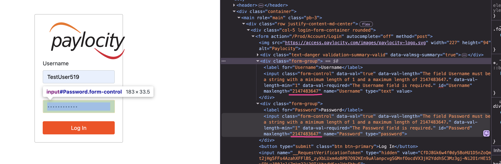

## UI-002 — Login with invalid credentials returns HTTP 405 instead of validation message

**Priority:** Medium  
**Type:** Error Handling

---

### Description
When a user attempts to log in with invalid credentials, the application returns an **HTTP 405 error page** instead of displaying a user-friendly authentication error message.

---

### Environment
**Application:** Paylocity Benefits Dashboard  
**Browser:** Chrome  

---

### Steps to Reproduce
1. Navigate to the login page:  
https://wmxrwq14uc.execute-api.us-east-1.amazonaws.com/Prod/Account/Login
2. Enter an invalid username (e.g., `TestUse01`).
3. Enter invalid password.
4. Click **Log In**.

---

### Actual Result
An **HTTP ERROR 405** page is displayed.

---

### Expected Result
A user-friendly message should appear:

---

### Screenshot

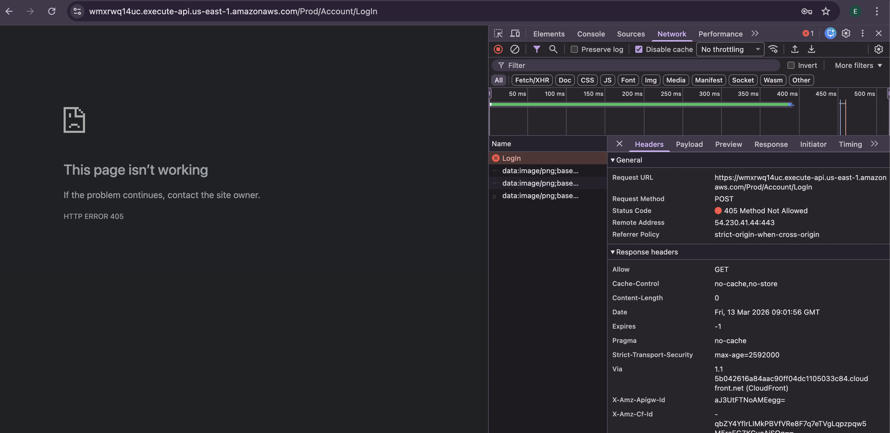

## UI-003 — Benefits Dashboard title displayed and clickable on Login page

**Priority:** Medium  
**Type:** UI / Navigation  

---

### Description
The **"Paylocity Benefits Dashboard"** title is displayed on the **Login page** and is clickable. 

---

### Environment
**Application:** Paylocity Benefits Dashboard  
**Browser:** Chrome  

---

### Steps to Reproduce
1. Navigate to the login page:  
https://wmxrwq14uc.execute-api.us-east-1.amazonaws.com/Prod/Account/Login
2. Observe the **"Paylocity Benefits Dashboard"** title in the top-left corner.
3. Click the title.

---

### Actual Result
- The **"Paylocity Benefits Dashboard"** title is displayed on the login page.
- The title is **clickable**, suggesting navigation to the dashboard.

---

### Expected Result
- The **Benefits Dashboard title should not be displayed or clickable** on the login page.
- Navigation elements leading to the dashboard should only appear **after successful authentication**.

---

### Screenshot

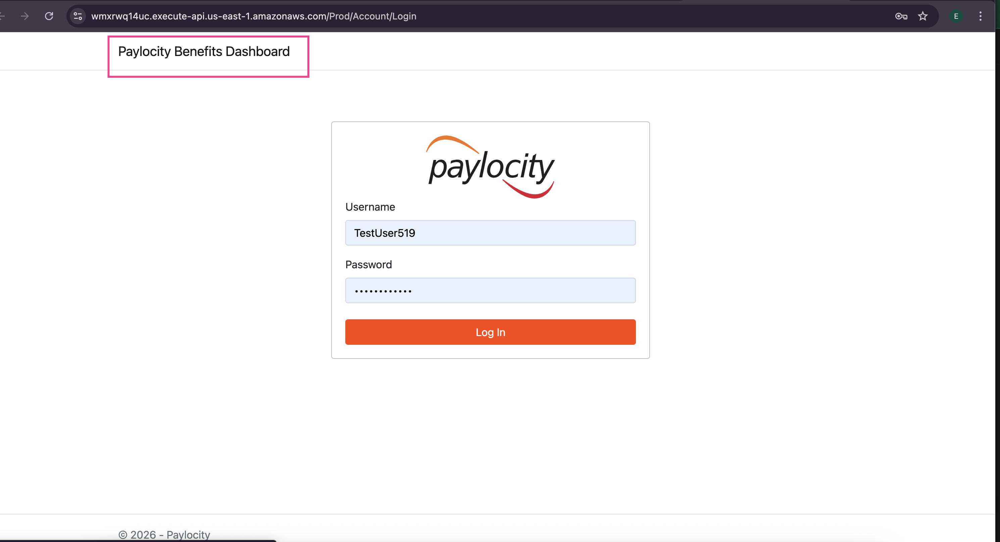


## UI-004 — First Name and Last Name displayed in incorrect columns when adding a new employee

**Priority:** Medium  
**Type:** UI  

---

### Description
On the **Paylocity Benefits Dashboard**, when adding a new employee, the **First Name** and **Last Name** are displayed in the wrong columns in the employee table. The **Last Name column shows the first name**, and the **First Name column shows the last name**.  

This can cause confusion for employers and data inconsistencies.

---

### Environment
**Application:** Paylocity Benefits Dashboard  
**Browser:** Chrome   

---

### Steps to Reproduce
1. Navigate to the **Paylocity Benefits Dashboard**.
2. Click **Add Employee**.
3. Enter values for **First Name** and **Last Name**.
4. Save the new employee.
5. Check the employee table and observe which column shows the **First Name** and which shows the **Last Name**.

---

### Actual Result
- The **First Name** and **Last Name** appear in the **wrong columns** in the employee table.

---

### Expected Result
- **First Name** should appear under the **First Name** column.  
- **Last Name** should appear under the **Last Name** column.

---

### Screenshot

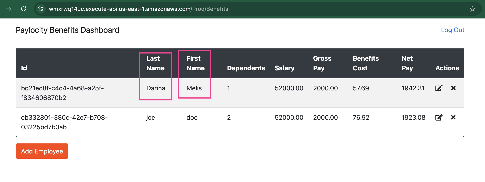


## UI-005 — Name fields allow special characters when adding a new employee

**Priority:** Medium  
**Severity:** Minor  
**Type:** Validation / Input

---

### Description
On the **Paylocity Benefits Dashboard**, when adding a new employee, the **First Name** and **Last Name** fields allow **special characters**, such as `#` or `@`. 
Name fields should normally only allow alphabetic characters. 
Accepting arbitrary special characters can lead to **data quality issues** or **display problems** in the employee table.

---

### Environment
**Application:** Paylocity Benefits Dashboard  
**Browser:** Chrome  

---

### Steps to Reproduce
1. Navigate to the **Paylocity Benefits Dashboard**.
2. Click **Add Employee**.
3. Enter a **First Name** or **Last Name** containing a special character (e.g., `#`, `@`, `!`).
4. Save the new employee.
5. Observe the employee table.

---

### Actual Result
- Special characters (e.g., `#`) are accepted in the **First Name** and **Last Name** fields.
- The employee is successfully added with invalid characters.

---

### Expected Result
- Special characters should **not be allowed**.  
- Only valid characters for names should be accepted.

---

### Screenshot

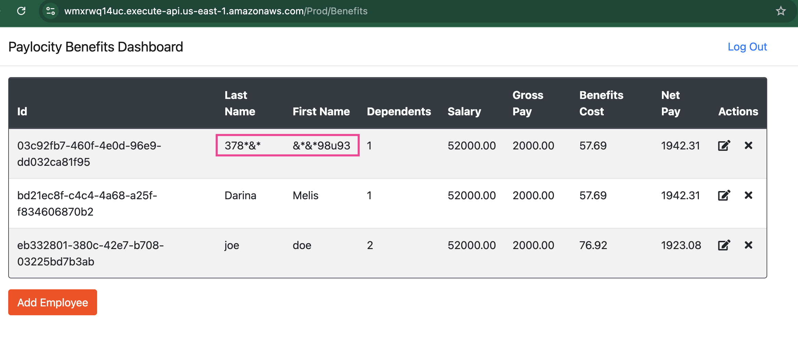


## UI-006 — No error message displayed when adding employee fails

**Priority:** High  
**Type:** Validation

---

### Description
When attempting to add a new employee without filling required fields, the employee creation request fails but the UI does not display any error message. 

---

### Environment
**Application:** Paylocity Benefits Dashboard  
**Browser:** Chrome  

---

### Steps to Reproduce
1. Navigate to the **Paylocity Benefits Dashboard**.
2. Click **Add Employee**.
3. Leave the required text fields empty.
4. Click **Add**.
5. Observe the UI after the request fails.

---

### Actual Result
- The employee is not created.
- **No error message or validation feedback is displayed**.
- Required fields are not visually highlighted.

---

### Expected Result
- The UI should display a **clear error message** when employee creation fails.
- **Required fields should be visibly indicated** (e.g., `*`).

---

### Screenshot

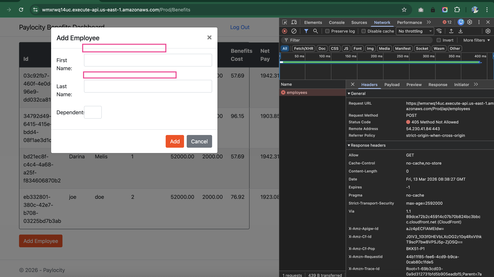

## UI-007 — Employee ID displayed as raw GUID instead of user-friendly identifier

**Priority:** Medium  
**Type:** UI / Usability  

---

### Description
The **Employee ID** column displays a raw **GUID value** in the employee table. 

---

### Environment
**Application:** Paylocity Benefits Dashboard  
**Browser:** Chrome  

---

### Steps to Reproduce
1. Navigate to the login page:  
https://wmxrwq14uc.execute-api.us-east-1.amazonaws.com/Prod/Account/Login
2. Log in to the application using valid credentials.
3. Observe the **ID** column for any employee in the table.

---

### Actual Result
The **Employee ID** is displayed as a full **GUID value** in the UI.

---

### Expected Result
The ID should be displayed in a **user-friendly format**, such as:
- A simple sequential ID (e.g., `001`, `002`)

---

### Screenshot

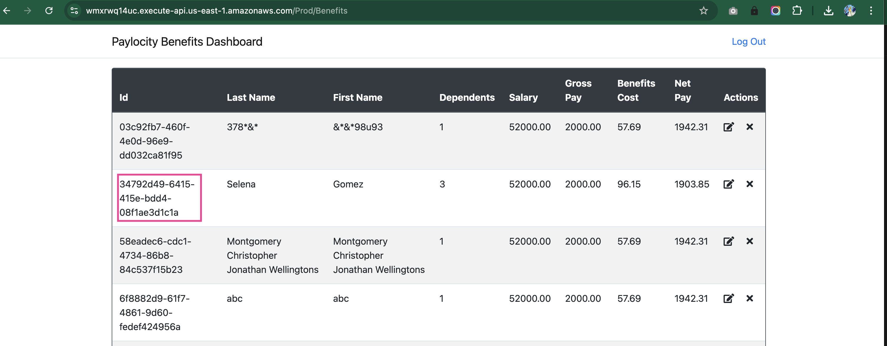

## UI-008 — Table layout breaks when long First Name or Last Name values are displayed

**Priority:** Low  
**Type:** UI / Layout  

---

### Description
When employees are added with long **First Name** or **Last Name** values (up to the allowed maximum length), the table layout on the **Benefits Dashboard** breaks. The columns overlap and the table loses proper spacing.

---

### Environment
**Application:** Paylocity Benefits Dashboard  
**Browser:** Chrome  

---

### Steps to Reproduce
1. Navigate to the login page:  
https://wmxrwq14uc.execute-api.us-east-1.amazonaws.com/Prod/Account/Login
2. Log in using valid credentials.
3. Click **Add Employee**.
4. Enter a **First Name** and **Last Name** with the maximum allowed length (50 characters).
5. Enter a value for **Dependents**.
6. Click **Add**.
7. Observe the employee table.

---

### Actual Result
- The table layout breaks when long names are displayed.
- Columns overlap and margins become inconsistent.

---

### Expected Result
- The table should **adjust responsively** to long values.
- Long text should wrap, truncate, or resize the column appropriately.

---

### Screenshot

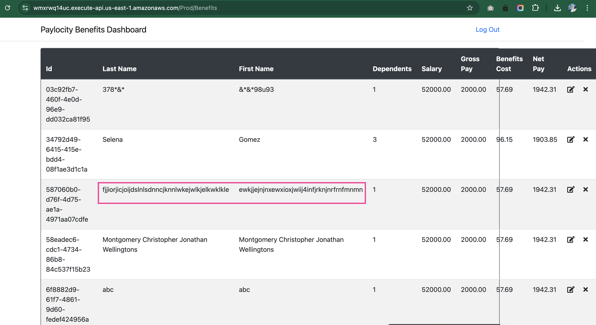

## UI-009 — Employee table has no default sorting

**Priority:** Medium  
**Type:** UI / Usability  

---

### Description
The employee table on the **Paylocity Benefits Dashboard** does not apply any sorting criteria. Making it difficult for users to quickly locate specific records when multiple employees exist.

---

### Environment
**Application:** Paylocity Benefits Dashboard  
**Browser:** Chrome  

---

### Steps to Reproduce
1. Navigate to the login page:  
https://wmxrwq14uc.execute-api.us-east-1.amazonaws.com/Prod/Account/Login
2. Log in using valid credentials.
3. Add at least **four employees** to the table.
4. Observe the order of employees displayed.

---

### Actual Result
- Employees appear in the table in **no clear or consistent order**.

---

### Expected Result
- Employees should be **automatically sorted** (e.g., by **Employee ID** or **Name**) after creation to improve readability and usability.


## UI-010 — Table column headers cannot be used to sort employee records

**Priority:** Medium  
**Type:** UI / Usability  

---

### Description
The employee table on the **Paylocity Benefits Dashboard** does not allow users to sort records by clicking on column headers. Sorting functionality is commonly expected in data tables and helps users quickly organize and locate information.

---

### Environment
**Application:** Paylocity Benefits Dashboard  
**Browser:** Chrome  

---

### Steps to Reproduce
1. Navigate to the login page:  
https://wmxrwq14uc.execute-api.us-east-1.amazonaws.com/Prod/Account/Login
2. Log in using valid credentials.
3. Add at least **four employees** to the table.
4. Attempt to sort employees by clicking any **column header** (e.g., ID, First Name, Last Name).

---

### Actual Result
- Column headers are **not interactive**.
- Users **cannot sort** the table by any column.

---

### Expected Result
- Users should be able to **click column headers to sort records dynamically** (ascending or descending).

## UI-011 — Employee table displays all records without pagination or row limit

**Priority:** Medium  
**Type:** UI / Usability / Performance  

---

### Description
The employee table on the **Paylocity Benefits Dashboard** displays all records in a single view without pagination or row limits. When the number of employees increases, the table becomes long and difficult to navigate.

---

### Environment
**Application:** Paylocity Benefits Dashboard  
**Browser:** Chrome  

---

### Steps to Reproduce
1. Navigate to the login page:  
https://wmxrwq14uc.execute-api.us-east-1.amazonaws.com/Prod/Account/Login
2. Log in using valid credentials.
3. Add at least **20 employees** to the table.
4. Observe the employee table.

---

### Actual Result
- All employee records are displayed in a **single scrollable table**.
- There is **no pagination** or row limit.

---

### Expected Result
- The table should implement **pagination**.


## UI-012 — Employee table missing filtering or search functionality

**Priority:** Medium  
**Type:** UI

---

### Description
The employee table on the **Paylocity Benefits Dashboard** does not provide any filtering or search functionality. When the number of records increases, users cannot quickly locate specific employees and must manually scan the table.

---

### Environment
**Application:** Paylocity Benefits Dashboard  
**Browser:** Chrome  

---

### Steps to Reproduce
1. Navigate to the login page:  
https://wmxrwq14uc.execute-api.us-east-1.amazonaws.com/Prod/Account/Login
2. Log in using valid credentials.
3. Add at least **20 employees** to the table.
4. Attempt to **search or filter** employees by any field (e.g., Name or ID).

---

### Actual Result
- No **search bar or filtering options** are available.
- Users must manually scroll through all records to find an employee.

---

### Expected Result
- The table should provide **filtering or search functionality**.

---

## UI-013 — Edit Employee dialog title incorrectly shows “Add Employee”

**Priority:** Medium  
**Type:** UI / Usability  

---

### Description
When editing an existing employee, the dialog title incorrectly displays **“Add Employee”** instead of indicating that the user is editing an existing record. This may cause confusion about the action being performed.

---

### Environment
**Application:** Paylocity Benefits Dashboard  
**Browser:** Chrome  

---

### Steps to Reproduce
1. Navigate to the login page:  
https://wmxrwq14uc.execute-api.us-east-1.amazonaws.com/Prod/Account/Login
2. Log in using valid credentials.
3. Add at least one employee so it appears in the employee table.
4. Click the **Edit** icon in the **Actions** column.
5. Observe the dialog title.

---

### Actual Result
- The dialog title displays **“Add Employee”** even when editing an existing employee.

---

### Expected Result
- The dialog title should display **“Edit Employee”** when modifying an existing record.

---

### Screenshot

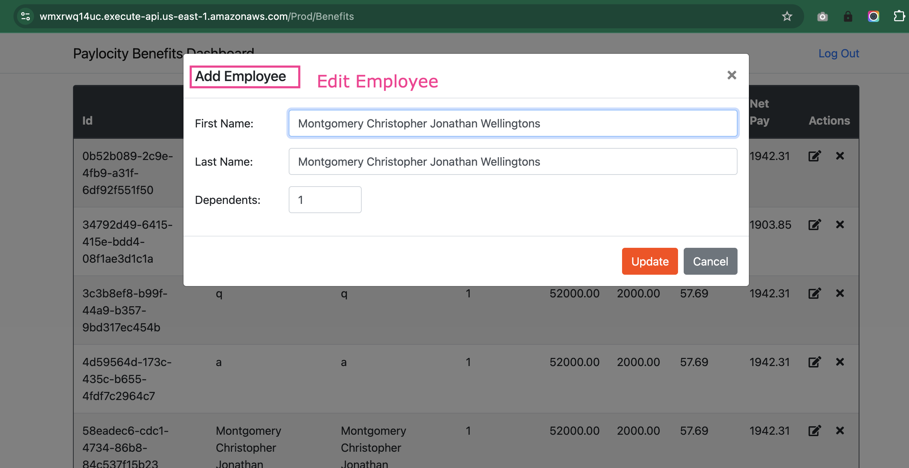

## UI-014 — Missing tooltips for Edit and Delete icons in Actions column

**Priority:** Low  
**Type:** UI 

---

### Description
The **Edit** and **Delete** icons in the **Actions** column do not display tooltips when hovered. Without tooltips, users may have difficulty understanding the purpose of the icons, especially when labels are not present.

---

### Environment
**Application:** Paylocity Benefits Dashboard  
**Browser:** Chrome  

---

### Steps to Reproduce
1. Navigate to the login page:  
https://wmxrwq14uc.execute-api.us-east-1.amazonaws.com/Prod/Account/Login
2. Log in using valid credentials.
3. On the **Paylocity Benefits Dashboard**, locate the **Actions** column.
4. Hover over the **Edit** and **Delete** icons.

---

### Actual Result
- No tooltip appears when hovering over the icons.

---

### Expected Result
- Each icon should display a tooltip on hover, such as:
  - **“Edit Employee”**
  - **“Delete Employee”**

---

### Screenshot

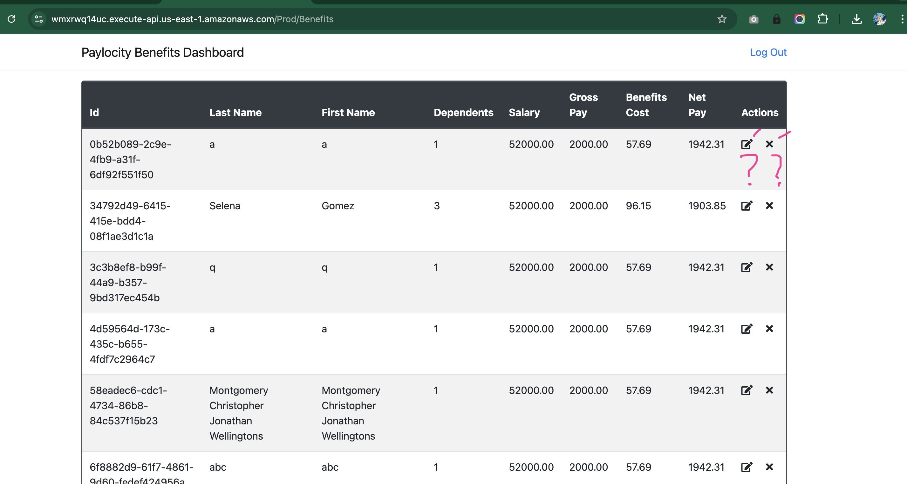

## UI-015 — "Add Employee" button placed at the bottom of the dashboard

**Priority:** Medium  
**Type:** UI

---

### Description
The **Add Employee** button is located at the bottom of the **Paylocity Benefits Dashboard**. This placement reduces visibility and requires users to scroll through the entire employee table before accessing the action.

---

### Environment
**Application:** Paylocity Benefits Dashboard  
**Browser:** Chrome  

---

### Steps to Reproduce
1. Navigate to the login page:  
https://wmxrwq14uc.execute-api.us-east-1.amazonaws.com/Prod/Account/Login
2. Log in using valid credentials.
3. Open the **Paylocity Benefits Dashboard**.
4. Locate the **Add Employee** button.

---

### Actual Result
- The **Add Employee** button appears at the **bottom of the page**, requiring users to scroll through all employee records to access it.

---

### Expected Result
- The **Add Employee** button should be placed in a **prominent and easily accessible location**, such as:
  - **Top-right or top-left corner of the table**
  - Near the page header

This improves visibility and reduces unnecessary scrolling.

---

## UI-016 — Expired session is not handled or communicated to the user

**Priority:** High  
**Type:** Session Management

---

### Description
When the user session expires, the application does not notify the user or redirect them to the login page. The user remains on the **Benefits Dashboard** even though API requests can no longer be completed.

---

### Environment
**Application:** Paylocity Benefits Dashboard  
**Browser:** Chrome  

---

### Steps to Reproduce
1. Log in to the application.
2. Wait until the session/token expires.
3. Refresh the page.
4. Attempt to perform any action (e.g., add or edit employee).

---

### Actual Result
- No message indicating the session has expired.
- User remains on the dashboard.
- API calls fail.

---

### Expected Result
- User is notified and redirected to the login page.


## API-001 — Incorrect status code returned for invalid payload in POST /api/employees

**Priority:** High  
**Type:** Employee Update API Design 

---

### Description
When sending an invalid payload to the **POST /api/employees** endpoint, the API returns **405 Method Not Allowed** instead of a validation error.  
This behavior is incorrect because the request method itself is valid; only the request payload is invalid.

The API should validate the request body and return an appropriate client error indicating that the request data is invalid.

---

### Environment
**Application:** Paylocity Benefits API  
**Tool:** Postman  

---

### Steps to Reproduce
1. Send a request to the endpoint: POST /api/employees
2. Use the following request payload:

```json
{
  "firstName": "",
  "lastName": "",
  "dependants": null
}
```
3. Send the request and observe the response.


## Actual Result

- API returns **405 Method Not Allowed**
- The response does **not** contain a meaningful validation error message explaining the issue with the payload.

## Expected Result

- API should **validate the request payload**
- The endpoint should return **400 Bad Request** for invalid input
- The response should contain a clear validation message indicating which fields are invalid

### Example Response

```json
{
  "error": "Invalid request payload",
  "details": "firstName, lastName and dependants are required fields"
}
```

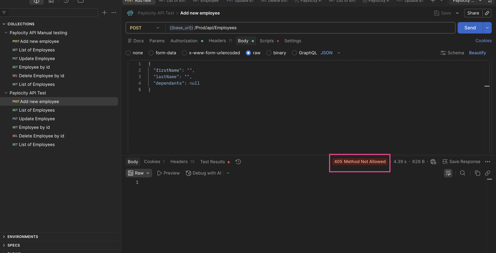


## API-002 — Inconsistent employee update endpoint: missing PUT /employees/{id}

**Severity / Priority:** Minor  
**Component:** Employee Update API Design  

---

### Description
The **employee update endpoint** is inconsistent with REST best practices.  

Currently:  
- `GET /employees/{id}` exists  
- `DELETE /employees/{id}` exists  
- `PUT /employees` exists, but requires the employee ID in the request body instead of the URL  

A standard RESTful design would provide a **PUT /employees/{id}** endpoint for updating a specific employee resource.

---

### Environment
**Application:** Paylocity Benefits API  
**Tool:** Postman  

---

### Steps to Reproduce / Observe
1. Inspect existing endpoints:  
   - `GET /employees/{id}`  
   - `DELETE /employees/{id}`  
2. Attempt to locate `PUT /employees/{id}` → endpoint does not exist  
3. Observe that updates are performed via `PUT /employees` with the `id` included in the request body  

---

### Actual Result
- Requires the `id` to be included in the request body  
- Lacks symmetry with other endpoints and deviates from standard REST practices  

---

### Expected Result
- Provide a `PUT /employees/{id}` endpoint  

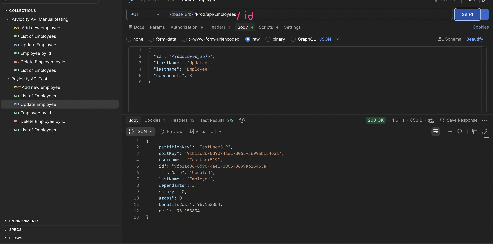


## API-003 — [DELETE /api/employees] returns 200 OK instead of 204 No Content

**Priority:** Minor
**Component:** Employee Update API Design  

---

### Description
The **DELETE /api/employees** endpoint currently returns a **200 OK** status after successfully deleting an employee record.  

According to common REST conventions, a successful deletion should return **204 No Content**.

---

### Environment
**Application:** Paylocity Benefits API  
**Tool:** Postman  

---

### Steps to Reproduce
1. Send a `DELETE` request for an existing employee record via `/api/employees`  
2. Observe the returned HTTP status code  

---

### Actual Result
- **200 OK** is returned after successful deletion  

---

### Expected Result
- **204 No Content** should be returned for a successful deletion  

---

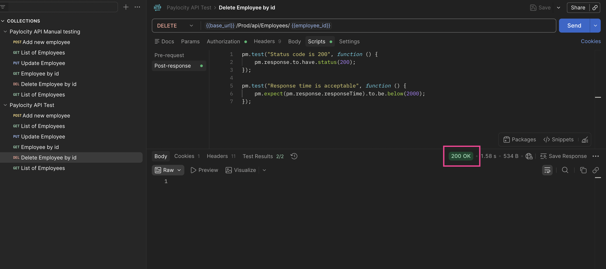


## API-004 — Salary cannot be set via POST; always 52000 (hardcoded/default)

**Priority:** Major  
**Component:** Employee Create API  

---

### Description
The **POST /api/employees** endpoint ignores the `Salary` field in the request body.  

Regardless of the value provided by the client, the persisted salary is always **52000**. 

---

### Environment
**Application:** Paylocity Benefits API  
**Tool:** Postman  

---

### Steps to Reproduce
1. Send a `POST /api/employees` request with a `Salary` value different from 52000.  
2. Retrieve the created employee or inspect the persisted data.  
3. Observe that the `Salary` remains **52000**, regardless of the value sent.  

---

### Actual Result
- Salary is always **52000**  

---

### Expected Result
- Salary should be settable on employee creation.

---

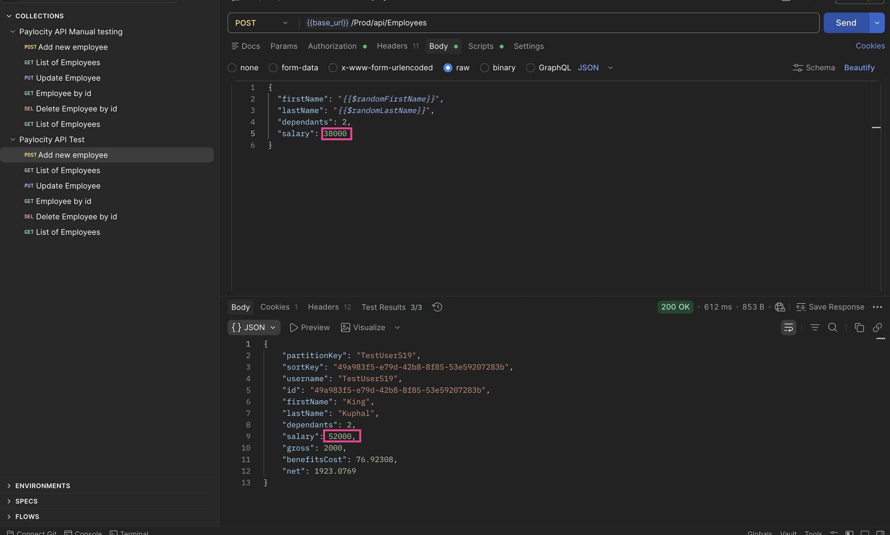


## API-005 — GET /employees/{id} returns 200 OK with empty body for non-existing employee

**Priority:** Major  
**Component:** Employee Retrieval API  

---

### Description
The **GET /employees/{id}** endpoint returns **200 OK** with an empty response body when the requested employee does not exist.  

---

### Environment
**Application:** Paylocity Benefits API  
**Tool:** Postman  

---

### Steps to Reproduce
1. Call `GET /employees/{id}` with an ID that does not exist.  
2. Observe the response status and body.  

---

### Actual Result
- **200 OK** is returned  
- Response body is empty  

---

### Expected Result
- **404 Not Found** should be returned for a non-existing employee  
- Response should include a meaningful error payload indicating the employee was not found  

---

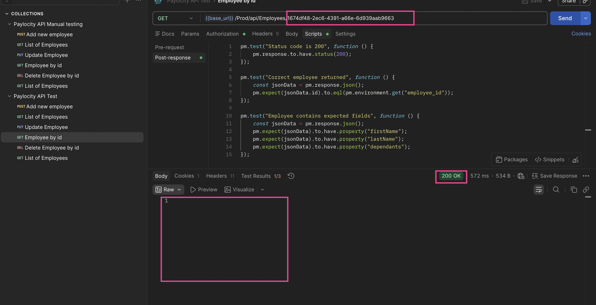


## API-006 — Wrong status code for invalid format GUID in GET /employees/{id}

**Priority:** High  
**Component:** Employee Retrieval API  

---

### Description
The **GET /employees/{id}** endpoint returns a **500 Internal Server Error** when the provided employee ID is an invalid GUID format.  

According to API best practices, the server should validate the request format and return a **400 Bad Request** for invalid IDs rather than failing with a server error.

---

### Environment
**Application:** Paylocity Benefits API  
**Tool:** Postman  

---

### Steps to Reproduce
1. Send a GET request to:  
   GET /employees/{invalid-id} 
2. Observe the returned HTTP status code  

---

### Actual Result
- **500 Internal Server Error** is returned  
- No meaningful error message provided  

---

### Expected Result
- **400 Bad Request** should be returned for invalid GUID formats  
- Response should include a descriptive message indicating the invalid format  

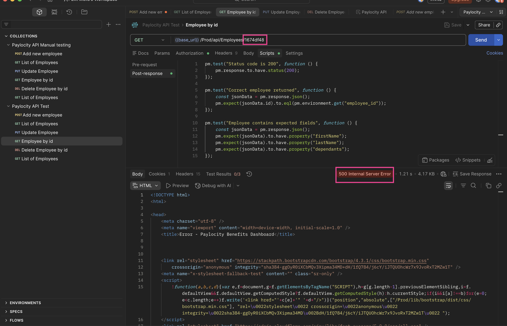